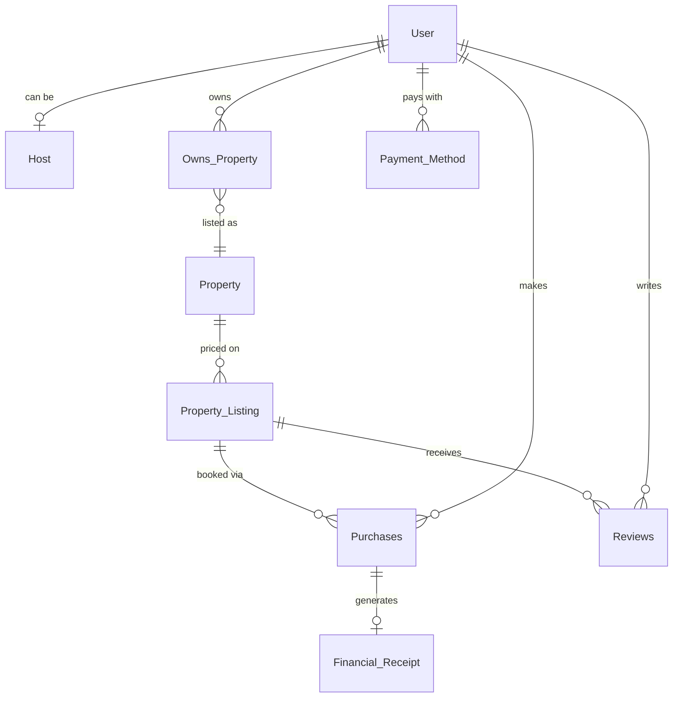

# Airbnb Database

A relational database modeling the core Airbnb domain: users, hosts, property and experience listings, bookings, reviews, and payments. 28 tables in MySQL 8, with stored procedures for creating properties and booking purchases.

## Schema

Core booking path:



[Full ER diagram (28 tables)](docs/er_diagram_dbeaver.png)

The design uses supertype/subtype relationships in two places. `Host` shares a primary key with `User`, since a host is a user with extra attributes rather than a separate entity. `Experience` splits into `In_Person_Experience` and `Online_Experience`, which have different required fields.

## Running it

Requires Docker.

```bash
docker compose up -d
```

MySQL runs `schema.sql` automatically on first start. Connect on `localhost:3306`, database `airbnb`, user `root`, password `devpass`.

Load the stored procedures and run the tests:

```bash
docker exec -i airbnb-db mysql -uroot -pdevpass airbnb < new_property.sql
docker exec -i airbnb-db mysql -uroot -pdevpass airbnb < new_purchase.sql
docker exec -i airbnb-db mysql -uroot -pdevpass airbnb < test_procedures.sql
```

To reset to a clean schema:

```bash
docker compose down -v && docker compose up -d
```

## Stored procedures

`New_Property` inserts a property and assigns the next available ID.

`New_Purchase` books a listing, computing the total rate from nights stayed, nightly cost, cleaning fee, and service fee, and generating a confirmation code.

## Tests

`test_procedures.sql` inserts sample data, calls both procedures, and prints the results with expected values in comments. Property IDs should come out 1 and 2, and the two purchases should total 675.00 and 360.00.

The two listings are priced differently on purpose. An earlier version of `New_Purchase` looked up fees with `WHERE Listing_ID = Listing_ID`, where both sides resolved to the parameter rather than the column, so the condition was always true and the query returned an arbitrary listing's pricing without raising an error. With identical test data that bug is invisible.

## Files

| File | Purpose |
|---|---|
| `schema.sql` | Table definitions |
| `new_property.sql` | `New_Property` procedure |
| `new_purchase.sql` | `New_Purchase` procedure |
| `test_procedures.sql` | Assertion tests |
| `docker-compose.yml` | Local MySQL 8 |

## Known limitations

`Purchases.Listing_ID` references `Property_Listing` only, so experience bookings cannot currently be recorded. Fixing this properly requires a `Listing` supertype that both listing types inherit from, with `Purchases`, `Reviews`, and `Financial_Receipt` repointed at it.
